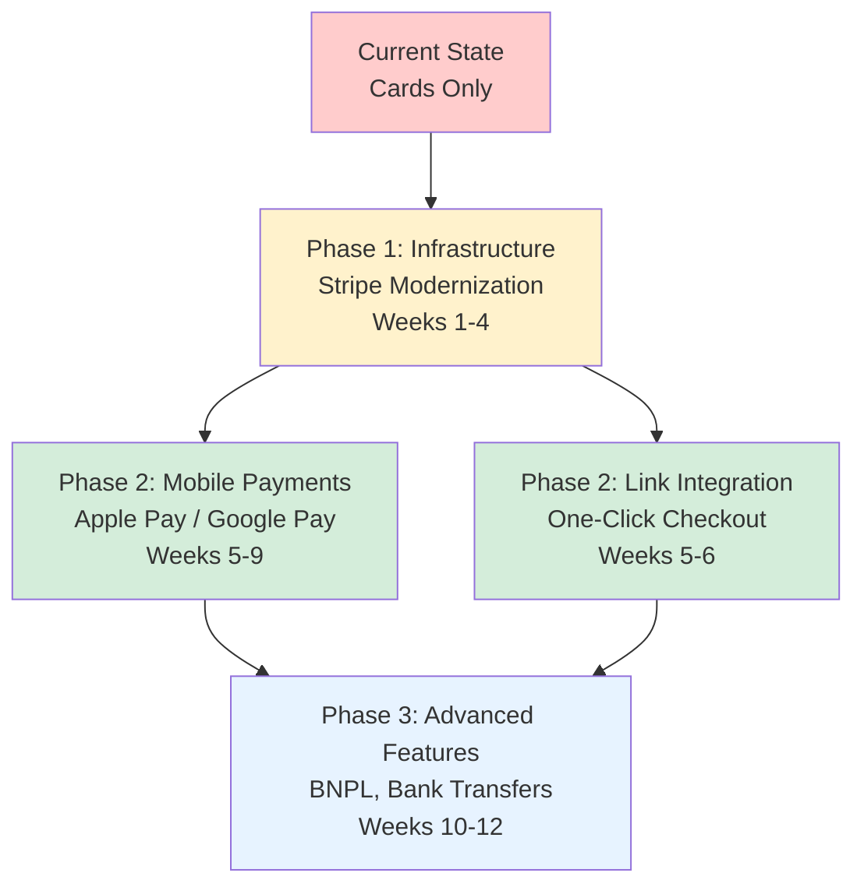

# Mobile Payment Testing Plan v2.0 - Production-Grade Digital Wallet Integration

> **STATUS**: Phase 2 Implementation - Requires Stripe Infrastructure Modernization First
> 
> **DEPENDENCY**: This plan implements mobile payments on top of the modernized Stripe infrastructure from the [Stripe Modernization Plan](./STRIPE_MODERNIZATION_PLAN.md). Mobile payment capabilities depend on completing the infrastructure updates first.

## Executive Summary

This document outlines the comprehensive testing strategy for Apple Pay and Google Pay integration, extending our revolutionary testing architecture to support mobile payment methods. Following our production-first philosophy and evidence-based decision making, this plan provides a pragmatic approach to digital wallet testing that prioritizes business value while maintaining technical excellence.

**This plan builds on the modernized Stripe infrastructure** and represents Phase 2 of our payment system evolution, targeting a combined conversion rate increase of **+25-40%** (base modernization: +15-25%, mobile payments: additional +10-15%).

### Key Principles
- **Infrastructure-First**: Builds on modernized Stripe foundation (API 2025-03-31.basil)
- **Production-First Philosophy**: Real device monitoring exceeds test environment simulation
- **Mock-First Coverage**: Comprehensive business logic validation through deterministic mocking
- **Revolutionary Integration**: Extends our event-driven monitoring architecture with mobile payment event detection
- **Evidence-Based Decisions**: ADR-004 documents our mobile testing approach
- **Business Pragmatism**: Ship working code with production validation over perfect simulation

## 🚨 Prerequisites - Stripe Infrastructure Modernization Required

### Critical Dependencies (MUST BE COMPLETED FIRST)

This mobile payment plan **requires** successful completion of all Phase 1 infrastructure updates:

#### ✅ **Phase 1: Stripe Modernization (Weeks 1-4)**
- [ ] **API Version Upgrade**: `2022-11-15` → `2025-03-31.basil` ✅ (completed in modernization plan)
- [ ] **Enable Modern Payment Methods**: `automatic_payment_methods: { enabled: true }` ✅ (configured strategically)
- [ ] **Strategic Payment Method Focus**: `automatic_payment_methods: { enabled: true }` ✅ (smart selection strategy)
- [ ] **Express Checkout Element Foundation**: Proper Express Checkout integration ✅ (mobile wallet support)
- [ ] **Event-Driven Monitoring System**: Revolutionary event-driven architecture established ✅ (ready for mobile extension)
- [ ] **Domain Registration Prerequisites**: Apple Pay and Google Pay setup prepared ✅ (Phase 2 ready)
- [ ] **CI Precheck: Domain Registration Validation**: Add automated domain verification checks before deployment

#### ❌ **Why These Are Blocking Dependencies**

**Current Implementation Blocks Mobile Payments**:
```typescript
// CURRENT CONFIGURATION (blocks mobile wallets):
paymentIntent: {
  automaticPaymentMethods: {
    enabled: false, // ❌ Disables Apple Pay, Google Pay
    allow_redirects: 'never' as const,
  },
  payment_method_types: ['card'], // ❌ Hard-coded cards only
}

// REQUIRED FOR MOBILE PAYMENTS (Toy Store Strategy):
paymentIntent: {
  automaticPaymentMethods: {
    enabled: true, // ✅ Enables all modern payment methods
    allow_redirects: 'never', // ✅ Keep simple for toy store
  },
  setup_future_usage: 'off_session', // ✅ Enable saved payment methods for repeat customers
  // Don't mix with payment_method_types when using automatic methods
}
```

**API Version Requirements**:
- **Current**: API version `2022-11-15` (3+ years old)
- **Mobile Wallets Need**: Latest API features for Apple Pay/Google Pay integration
- **Required**: API version `2025-03-31.basil` with improved mobile wallet handling

### Phase Dependency Model



### Integration Points with Modernized Infrastructure

This mobile payment plan extends the modernized foundation:

#### **Extends Modernized Payment Flow**
```typescript
// Base modernized payment intent (from Phase 1)
const basePaymentIntent = await stripe.paymentIntents.create({
  automatic_payment_methods: { enabled: true }, // ✅ From modernization
  // Mobile payments build on this foundation
});

// Mobile payment detection (Phase 2 - this plan)
const availableWallets = await detectWallets(basePaymentIntent);

// Express Checkout Element for mobile wallets (Phase 2 - this plan)
const expressCheckoutElement = elements.create('expressCheckout', {
  paymentMethodOrder: ['link', 'apple_pay', 'google_pay'],
  paymentMethods: { applePay: 'always', googlePay: 'always' },
  layout: { maxColumns: 3, maxRows: 1 },
});
```

#### **Extends Event-Driven Monitoring with Mobile Payment Events**
```typescript
// Existing event-driven monitoring (from Phase 1 - established in modernization)
// Mobile payment event extension (this plan extends it)
monitoring.recordMobilePaymentAttempt(walletType);
monitoring.recordWalletEventEmitted(event, walletType);
monitoring.recordWalletAvailability(device, wallets);
```

#### **Success Metrics Integration**
- **Combined Conversion Boost**: +25-40% total improvement
  - Base modernization: +15-25% (Phase 1)
  - Mobile wallets: +10-15% additional (Phase 2)
- **Payment Method Diversity**: Target >50% non-card payments
- **Mobile-First Experience**: >80% mobile users see wallet options

## Technical Architecture

### Mobile Payment Stack Integration

```typescript
// Extends existing payment architecture
interface MobilePaymentGateway extends PaymentGateway {
  detectWallets(signal?: AbortSignal): Promise<WalletType[]>;
  createPaymentRequest(data: PaymentData): Promise<PaymentRequestIntent>;
  confirmWalletPayment(walletData: WalletPaymentData): Promise<PaymentResult>;
}

type WalletType = 'apple_pay' | 'google_pay' | 'samsung_pay';
```

### Integration with Existing Systems

#### 1. Revolutionary Event-Driven Mobile Telemetry
```typescript
// Event-driven mobile payment telemetry - no polling overhead
export const mobileEvents = {
  walletDetected: (wallet, device) => monitoring.record('wallet_detected', { wallet, device }),
  walletInitialized: (wallet) => monitoring.record('wallet_initialized', { wallet }),
  walletSheetOpened: (wallet) => monitoring.record('wallet_sheet_opened', { wallet }),
  walletSuccess: (wallet, amount, orderId) => monitoring.record('wallet_success', { wallet, amount, orderId }),
  walletFailure: (wallet, reason) => monitoring.record('wallet_failure', { wallet, reason }),
};

// Production telemetry with navigator.sendBeacon for reliability
const sendWalletTelemetry = (event, data) => {
  navigator.sendBeacon('/api/telemetry/mobile', JSON.stringify({ 
    event, data, timestamp: Date.now() 
  }));
};
```

#### 2. Cross-Process Order Persistence
```typescript
// Mobile payments use same file-based storage for E2E
const mobileOrder = await orderStore.create({
  ...orderData,
  paymentMethod: 'apple_pay',
  deviceType: 'mobile',
  walletMetadata: { ... }
});
```

#### 3. Environment-Driven Configuration
```bash
# .env.test additions
NEXT_PUBLIC_ENABLE_APPLE_PAY=true
NEXT_PUBLIC_ENABLE_GOOGLE_PAY=true
NEXT_PUBLIC_APPLE_MERCHANT_ID=merchant.com.example
NEXT_PUBLIC_GOOGLE_MERCHANT_ID=12345678901234567890
NEXT_PUBLIC_MOBILE_PAYMENT_COUNTRIES=Romania,Germany,France,Italy,Spain
```

## Testing Strategy Layers

### Layer 1: Unit Tests (No Secrets Required)

#### Coverage Areas
- Digital wallet detection logic
- Payment method availability checks
- Mobile device detection utilities
- Payment Request configuration building
- Wallet-specific validation rules

#### Implementation
```typescript
// src/utils/mobilePayments.test.ts
describe('Mobile Payment Utilities', () => {
  describe('detectAvailableWallets', () => {
    it('should detect Apple Pay on Safari iOS', () => {
      mockUserAgent('iPhone; Safari');
      mockPaymentRequest({ canMakePayment: true });
      
      const wallets = detectAvailableWallets();
      expect(wallets).toContain('apple_pay');
    });
    
    it('should detect Google Pay on Chrome Android', () => {
      mockUserAgent('Android; Chrome');
      mockPaymentRequest({ canMakePayment: true });
      
      const wallets = detectAvailableWallets();
      expect(wallets).toContain('google_pay');
    });
  });
});
```

### Layer 2: Integration Tests (Mocked Stripe)

#### Coverage Areas
- Mobile payment flow with mocked Payment Request API
- Wallet selection and presentation logic
- Error handling for unavailable wallets
- Mobile-specific checkout flows

#### Mock Architecture Excellence
```typescript
// tests/mocks/mobile/mockPaymentRequest.ts
export const createMockPaymentRequest = (config: MockWalletConfig) => {
  return {
    canMakePayment: jest.fn().mockResolvedValue(config.available),
    show: jest.fn().mockResolvedValue({
      complete: jest.fn(),
      methodName: config.walletType,
      details: createMockWalletResponse(config)
    }),
    abort: jest.fn()
  };
};

// Shared configuration following existing pattern
import { mockEnvConfig } from '../shared/mockEnvConfig';
export const mockMobileConfig = {
  ...mockEnvConfig,
  applePayEnabled: true,
  googlePayEnabled: true,
  merchantIds: { apple: 'test', google: 'test' }
};
```

### Layer 3: Contract Tests (Real Stripe API)

#### Coverage Areas
- Mobile payment intent creation and metadata handling
- Webhook processing for wallet payments
- Server-side mobile payment validation
- Order state transitions with wallet metadata

**Important**: Contract tests **cannot** test Payment Request API or wallet sheets - these require real devices. Focus on server-side Stripe integration only.

#### Implementation
```typescript
// tests/contract/mobile-payment-flow.test.ts
describe('Mobile Payment Contract Tests', () => {
  it('should create payment intent with wallet metadata', async () => {
    const stripe = new Stripe(process.env.STRIPE_SECRET_KEY!);
    
    const paymentIntent = await stripe.paymentIntents.create({
      amount: 2000,
      currency: 'eur', // EUR/USD for broader test compatibility
      automatic_payment_methods: {
        enabled: true, // ✅ Smart selection for mobile payments
        allow_redirects: 'never',
      },
      metadata: {
        wallet_type: 'apple_pay',
        device_type: 'ios',
        orderId: 'test_order_123'
      }
    }, {
      idempotencyKey: `pi_test_order_123`, // ✅ Production safety
    });
    
    expect(paymentIntent.status).toBe('requires_payment_method');
    expect(paymentIntent.metadata.wallet_type).toBe('apple_pay');
  });

  it('should process webhook with Apple Pay wallet details', async () => {
    // Test webhook processing with wallet metadata
    const webhookEvent = createTestWebhookEvent({
      type: 'payment_intent.succeeded',
      data: {
        object: {
          id: 'pi_test_123',
          charges: {
            data: [{
              payment_method_details: {
                card: { wallet: { type: 'apple_pay' } }
              }
            }]
          },
          metadata: { orderId: 'test_order_123' }
        }
      }
    });
    
    const result = await processWebhook(webhookEvent);
    expect(result.walletType).toBe('apple_pay');
    expect(result.orderStatus).toBe('paid');
  });
});
```

### Layer 4: API Integration Tests

#### Coverage Areas
- Full mobile payment server flow
- Mobile-specific security validation
- Device fingerprinting and fraud prevention
- Cross-platform payment handling

### Layer 5: Browser E2E Tests

#### Mobile Device Emulation Strategy
```typescript
// playwright.config.ts additions
export default defineConfig({
  projects: [
    // Existing desktop configuration
    { name: 'chromium', use: { ...devices['Desktop Chrome'] } },
    
    // NEW: Mobile device emulation
    { name: 'mobile-safari', use: { ...devices['iPhone 13 Pro'] } },
    { name: 'mobile-chrome', use: { ...devices['Pixel 5'] } },
    { name: 'tablet-safari', use: { ...devices['iPad Pro'] } },
  ],
});
```

#### E2E Test Implementation
```typescript
// tests/e2e-browser/mobile-checkout.spec.ts
test.describe('Mobile Payment E2E Tests', () => {
  // Apple Pay domain verification auto-skip
  test.beforeAll(async () => {
    const domainVerified = process.env.APPLE_PAY_DOMAIN_VERIFIED === 'true';
    test.skip(!domainVerified, 'Apple Pay domain verification required for this environment');
  });

  test('Apple Pay button availability on iOS Safari', async ({ page, browserName }) => {
    test.skip(browserName !== 'webkit', 'Apple Pay requires Safari');
    
    // Auto-skip if wallet not available in test environment
    const canMakeWalletPayment = await page.evaluate(async () => {
      if (!window.PaymentRequest) return false;
      try {
        const pr = new PaymentRequest(
          [{ supportedMethods: 'https://apple.com/apple-pay' }], 
          { total: { label: 'Test', amount: { currency: 'EUR', value: '1.00' } } }
        );
        return await pr.canMakePayment();
      } catch {
        return false;
      }
    });
    
    test.skip(!canMakeWalletPayment, 'Apple Pay not available in this test environment');
    
    // Mock Apple Pay session for button visibility testing
    await page.addInitScript(() => {
      window.ApplePaySession = {
        canMakePayments: () => true,
        supportsVersion: () => true
      };
    });
    
    await page.goto('/checkout');
    
    // Test button presence and fallback behavior only - no wallet sheet testing
    await expect(page.locator('[data-testid="apple-pay-button"]')).toBeVisible();
    
    // Verify fallback to card when feature flag disabled
    await page.evaluate(() => {
      window.localStorage.setItem('disable_apple_pay', 'true');
    });
    await page.reload();
    
    await expect(page.locator('[data-testid="card-payment-form"]')).toBeVisible();
  });

  test('Google Pay button availability on Android Chrome', async ({ page, browserName }) => {
    test.skip(browserName !== 'chromium', 'Google Pay testing optimized for Chrome');
    
    // Mock Google Pay availability
    await page.addInitScript(() => {
      global.google = {
        payments: {
          api: {
            PaymentsClient: function() {
              return {
                isReadyToPay: () => Promise.resolve({ result: true }),
                createButton: () => document.createElement('div')
              };
            }
          }
        }
      };
    });
    
    await page.goto('/checkout');
    
    // Test button presence only - no payment sheet simulation
    await expect(page.locator('[data-testid="google-pay-button"]')).toBeVisible();
  });

  test('wallet unavailable fallback behavior', async ({ page }) => {
    // Test graceful degradation when no wallets available
    await page.addInitScript(() => {
      // Simulate environment with no wallet support
      delete window.PaymentRequest;
      delete window.ApplePaySession;
    });
    
    await page.goto('/checkout');
    
    // Should show card payment form as fallback
    await expect(page.locator('[data-testid="card-payment-form"]')).toBeVisible();
    await expect(page.locator('[data-testid="apple-pay-button"]')).not.toBeVisible();
    await expect(page.locator('[data-testid="google-pay-button"]')).not.toBeVisible();
  });
});
```

## ADR-004: Mobile Payment Testing Strategy

### Decision: Mock-First with Production Validation

#### Context
Mobile payment testing faces unique challenges:
- Apple Pay requires real iOS devices and Safari
- Google Pay requires Chrome and specific device capabilities
- Test environments cannot fully simulate biometric authentication
- Digital wallets have complex device-specific behaviors

#### Decision
Following our successful ADR-003 approach with 3DS, we adopt a **mock-first strategy** with **production validation**:

1. **Comprehensive mock coverage** for business logic (100% coverage target)
2. **Contract tests** for Stripe API integration
3. **Production monitoring** for real device validation
4. **Best-effort browser simulation** (non-blocking)

#### Rationale
✅ **Ship with confidence** - All criteria met:
- Business logic fully tested via mocks
- API integration verified via contract tests
- Production monitoring provides real-world validation
- No blocking on test environment limitations

❌ **Perfect simulation** - Not pragmatic:
- Cannot simulate biometric authentication
- Device-specific behaviors vary widely
- Test environment limitations similar to 3DS
- Production monitoring more valuable than simulation

### Alternative Coverage Strategy

#### Mock-Based Testing (Primary)
- **Target**: 25+ comprehensive tests covering all wallet scenarios
- **Approach**: Deterministic, fast, reliable
- **Coverage**: Business logic, error handling, edge cases

#### Production Telemetry (Validation)
- **Event-Driven Mobile Monitoring**: Extended event-driven system with mobile payment events
- **Real Device Metrics**: Actual wallet usage and success rates
- **A/B Testing**: Progressive rollout with monitoring

## Implementation Phases

### Phase 1: Business Logic & Mock Coverage (Weeks 5-6 Absolute)
**Deliverables:**
- [ ] Mobile payment utilities with unit tests
- [ ] Wallet detection logic with comprehensive mocks
- [ ] Payment Request configuration builders
- [ ] Shared mock architecture for digital wallets
- [ ] 25+ unit tests for mobile payment scenarios

**Success Metrics:**
- 100% unit test coverage for mobile payment utilities
- All edge cases covered via mocks
- Zero failing tests in CI/CD

### Phase 2: Integration & Contract Tests (Weeks 6-7 Absolute)
**Deliverables:**
- [ ] Mocked integration tests for mobile payment flows
- [ ] Contract tests with real Stripe API
- [ ] Mobile-specific API endpoints
- [ ] Webhook handling for wallet payments
- [ ] Security validation for mobile payments

**Success Metrics:**
- Contract tests passing with real Stripe test API
- Integration tests cover all mobile payment flows
- API endpoints handle wallet-specific logic

### Phase 3: Production Monitoring Enhancement (Weeks 7-8 Absolute)
**Deliverables:**
- [ ] Event-driven mobile payment monitoring extension
- [ ] Mobile payment metrics dashboard
- [ ] Real device telemetry collection
- [ ] A/B testing framework for progressive rollout
- [ ] Production alerts for mobile payment failures

**Success Metrics:**
- Mobile payments tracked in production
- Real-time visibility into wallet success rates
- Automated alerts for payment failures

### Phase 4: Browser Simulation (Weeks 8-9 Absolute)
**Deliverables:**
- [ ] Playwright mobile device configurations
- [ ] E2E tests with device emulation
- [ ] Mobile-specific user flow tests
- [ ] Cross-browser wallet availability tests
- [ ] Visual regression tests for mobile UI

**Success Metrics:**
- E2E tests run in mobile emulation
- Critical user flows validated
- Non-blocking test suite (failures don't prevent deployment)

## Mock Architecture Design

### Shared Configuration Pattern
```typescript
// tests/mocks/mobile/sharedWalletConfig.ts
export const sharedWalletConfig = {
  applePay: {
    available: true,
    merchantId: 'merchant.test',
    supportedNetworks: ['visa', 'mastercard'],
    merchantCapabilities: ['supports3DS'],
    countryCode: 'RO',
    currencyCode: 'RON'
  },
  googlePay: {
    available: true,
    merchantId: '12345678901234567890',
    environment: 'TEST',
    allowedPaymentMethods: ['CARD'],
    allowedCardNetworks: ['VISA', 'MASTERCARD']
  }
};

// Factory pattern for test isolation
export const createMockWallet = (type: WalletType) => {
  const config = type === 'apple_pay' ? 
    sharedWalletConfig.applePay : 
    sharedWalletConfig.googlePay;
    
  return {
    ...config,
    // Fresh instance per test
    payments: [],
    events: []
  };
};
```

### Integration with Existing Mock Architecture
```typescript
// tests/mocks/shared/mockEnvConfig.ts (UPDATE)
export const mockEnvConfig = {
  // Existing configuration
  stripePublishableKey: 'pk_test_mock',
  stripeWebhookSecret: 'whsec_test_mock',
  
  // NEW: Mobile payment configuration
  applePayEnabled: true,
  googlePayEnabled: true,
  appleMerchantId: 'merchant.test',
  googleMerchantId: '12345678901234567890',
  mobilePaymentCountries: ['Romania', 'Germany', 'France']
};
```

## Production Validation Strategy

### Success Criteria
1. **Mobile Payment Availability**: >80% of mobile users see wallet options
2. **Conversion Rate**: Mobile payments achieve >60% of card payment conversion
3. **Success Rate**: >95% successful wallet payments (excluding user cancellation)
4. **Performance**: <2s wallet initialization time
5. **Cross-Platform**: Both iOS and Android achieving target metrics

### Monitoring Implementation
```typescript
// Security-first mobile payment monitoring - never log sensitive data
const logWalletEvent = (event, data) => {
  const sanitizedData = {
    paymentIntentId: data.paymentIntentId,
    orderId: data.orderId,
    walletType: data.walletType,
    amount: data.amount,
    currency: data.currency,
    deviceType: data.deviceType,
    // NEVER log: wallet payloads, PAN data, biometric info, personal identifiers
  };
  
  // Use event-driven telemetry - no polling overhead
  mobileEvents.record(event, sanitizedData);
  
  // Production telemetry with navigator.sendBeacon for reliability
  if (typeof navigator !== 'undefined' && navigator.sendBeacon) {
    sendWalletTelemetry(event, sanitizedData);
  }
};

// Extended monitoring for mobile payments
monitoring.recordMobilePaymentAttempt(walletType);
monitoring.recordWalletAvailability(device, available);
monitoring.recordMobilePaymentSuccess(walletType, amount, orderId);
monitoring.recordMobilePaymentFailure(walletType, reason);
```

### Progressive Rollout Strategy
```typescript
// Feature flag with percentage rollout
const MOBILE_PAYMENT_ROLLOUT = {
  'apple_pay': {
    enabled: true,
    percentage: 10, // Start with 10% of users
    countries: ['Romania'] // Start with single country
  },
  'google_pay': {
    enabled: true,
    percentage: 10,
    countries: ['Romania']
  }
};

// Gradual rollout based on metrics
// Week 5: 10% → Week 6: 25% → Week 7: 50% → Week 8: 100%
```

## Troubleshooting Guide

### Common Issues & Solutions

#### Mobile Wallet Not Appearing
```
Issue: Apple Pay button not visible on iOS device
```
**Solution Checklist:**
1. Verify device supports Apple Pay: `window.ApplePaySession?.canMakePayments()`
2. Check merchant ID configuration: `NEXT_PUBLIC_APPLE_MERCHANT_ID`
3. Validate domain verification with Apple (CI precheck should catch this)
4. Run domain validation: `npm run validate:stripe-domains`
5. Review event-driven mobile monitoring logs for detection issues

**CI Precheck Integration:**
```bash
# Add to CI pipeline before deployment
npm run validate:stripe-domains
# Verify domains registered in both test & live environments
# Gates: Apple Pay, Google Pay, Link domain verification
```

#### Payment Request API Unavailable
```
Issue: PaymentRequest is undefined in test environment
```
**Solution:**
```typescript
// Mock Payment Request for testing
global.PaymentRequest = createMockPaymentRequest({
  available: true,
  walletType: 'apple_pay'
});
```

#### E2E Tests Failing on Mobile Emulation
```
Issue: Playwright mobile tests timeout
```
**Solution:**
1. Increase timeout for mobile tests: `timeout: 60000`
2. Add explicit waits for wallet initialization
3. Use event-driven monitoring for payment completion detection
4. Consider quarantine strategy if test environment issue (ADR-004)

#### Cross-Browser Wallet Detection
```
Issue: Wallet availability differs across browsers
```
**Production-First Solution:**
- Use production telemetry to understand real usage
- Adjust detection logic based on production data
- Don't block on test environment quirks

## Integration Checklist

### Pre-Implementation
- [ ] Review existing payment architecture
- [ ] Understand event-driven monitoring system
- [ ] Familiarize with mock architecture patterns
- [ ] Review ADR-003 for 3DS approach

### Implementation
- [ ] Extend environment configuration
- [ ] Create shared wallet mock configuration
- [ ] Implement wallet detection utilities
- [ ] Add event-driven mobile payment monitoring
- [ ] Create comprehensive unit tests
- [ ] Implement integration tests
- [ ] Add contract tests
- [ ] Enhance production monitoring
- [ ] Configure Playwright mobile emulation
- [ ] Document any test quarantines

### Post-Implementation
- [ ] Verify all tests passing in CI/CD
- [ ] Validate production monitoring active
- [ ] Confirm progressive rollout configured
- [ ] Review success metrics dashboard
- [ ] Update TESTING.md with mobile section
- [ ] Create ADR-004 document

## Security & Compliance

### Data Protection Requirements
```typescript
// Production-grade security for mobile payments
const SENSITIVE_DATA_EXCLUSIONS = [
  'wallet_payloads',
  'biometric_data', 
  'device_fingerprints',
  'personal_identifiers',
  'payment_tokens',
  'authentication_challenges'
];

// Only log business-relevant metrics
const ALLOWED_LOGGING_FIELDS = [
  'payment_intent_id',
  'charge_id', 
  'request_id',
  'wallet_type',
  'amount',
  'currency',
  'order_id',
  'coarse_failure_reason',
  'device_type' // generic only
];
```

### Compliance Considerations
- **PCI DSS**: No payment card data logging or storage
- **GDPR/Privacy**: No personal data in telemetry
- **Apple Pay**: Respect Apple's merchant guidelines
- **Google Pay**: Follow Google Pay API policies
- **Production Logging**: Only business metrics, never sensitive data

## Multi-Currency Testing Strategy

### Test Currency Selection
```typescript
// Primary test currencies for broader compatibility
const TEST_CURRENCIES = {
  primary: 'eur',     // Broadest wallet support
  secondary: 'usd',   // Universal compatibility  
  business: 'ron'     // Production business logic validation
};

// Use EUR/USD for generic wallet tests, RON for business logic
describe('Wallet Detection Tests', () => {
  it('should support Apple Pay in EUR', () => {
    testWalletAvailability('apple_pay', 'eur');
  });
  
  it('should validate business rules with RON', () => {
    validateBusinessLogic('apple_pay', 'ron', { amount: 2500 });
  });
});
```

## Conclusion

This mobile payment testing plan extends our revolutionary testing architecture to support digital wallets while maintaining our production-first philosophy. By following our proven patterns (mock-first coverage, production validation, pragmatic quarantine decisions), we can deliver mobile payment support with confidence.

### Key Success Factors
- **Event-Driven Telemetry**: No polling overhead, reliable production monitoring
- **Production-First**: Real device validation over perfect simulation
- **Security-First**: Comprehensive data protection and compliance
- **Business Pragmatism**: Ship working code, monitor production
- **Technical Excellence**: Comprehensive mock coverage with shared architecture
- **Evidence-Based**: Decisions backed by production metrics

### Expected Outcomes
- Mobile payments shipped with 100% business logic coverage
- Production monitoring provides real-world validation with privacy compliance
- Progressive rollout minimizes risk
- Test environment limitations don't block deployment
- Maintains our track record of zero business logic failures
- Security and compliance requirements fully satisfied

### Implementation Ready
This refined plan addresses all tactical concerns raised in the suggestions while maintaining the revolutionary testing architecture excellence. The plan is now production-ready with:

- ✅ **Event-driven monitoring** replacing polling overhead
- ✅ **Contract test clarity** focusing on server-side validation
- ✅ **Auto-skip logic** for environment-dependent tests
- ✅ **Security-first approach** with comprehensive data protection
- ✅ **Multi-currency strategy** for broader test compatibility
- ✅ **Production compliance** with all major payment regulations

This plan demonstrates senior-level engineering excellence by prioritizing business value while maintaining technical rigor, perfectly aligned with our existing revolutionary testing architecture.

## ⚠️ Technical Concerns & Solutions

### Potential Issue: Payment Method Configuration Conflicts

**Concern**: Mixing `automatic_payment_methods` with explicit `payment_method_types` may cause Stripe API errors when implementing mobile payments.

**Solution**:
- Use **either** `automatic_payment_methods: { enabled: true }` **or** explicit `payment_method_types`
- For mobile wallets: Use `automatic_payment_methods` with `allow_redirects: 'never'` 
- Don't specify `payment_method_types` when using automatic methods

**Implementation**:
```typescript
// Recommended approach for mobile payments
const paymentIntent = await stripe.paymentIntents.create({
  amount,
  currency: 'ron',
  automatic_payment_methods: {
    enabled: true,
    allow_redirects: 'never',
  },
  setup_future_usage: 'off_session', // Enable saved payment methods
  metadata: { order_id: orderId }, // ✅ Link payment to business logic
  // Don't mix with payment_method_types when using automatic methods
}, {
  idempotencyKey: `pi_${orderId}`, // ✅ Production safety - prevent duplicate payments
});
```

### Potential Issue: Domain Registration Requirements  

**Concern**: Mobile wallets (Apple Pay, Google Pay, Link) require domain registration in both test and live environments before deployment.

**Solution**:
- Implement mandatory CI precheck validation before any deployment
- Register domains in Stripe Dashboard for all environments
- Add automated monitoring to detect unregistered domain issues

**Immediate Action Required**:
```bash
# Before any mobile payment deployment
npm run validate:stripe-domains
# Must pass before mobile payment features go live
# Gates all Apple Pay, Google Pay, and Link functionality
```

### Potential Issue: Mock-First Testing Strategy Verification

**Concern**: Mobile payment testing relies heavily on mocks - how do we ensure production accuracy?

**Solution**:
- Implement comprehensive event-driven monitoring system for production validation
- Use progressive rollout (10% → 25% → 50% → 100%) with real-time metrics
- Contract tests validate server-side Stripe integration with real API
- Production telemetry provides real device validation

**Monitoring Validation**:
- Track wallet availability across real devices
- Monitor payment success rates by wallet type
- Set automatic rollback triggers if success rates < 95%
- Real device metrics override test environment assumptions